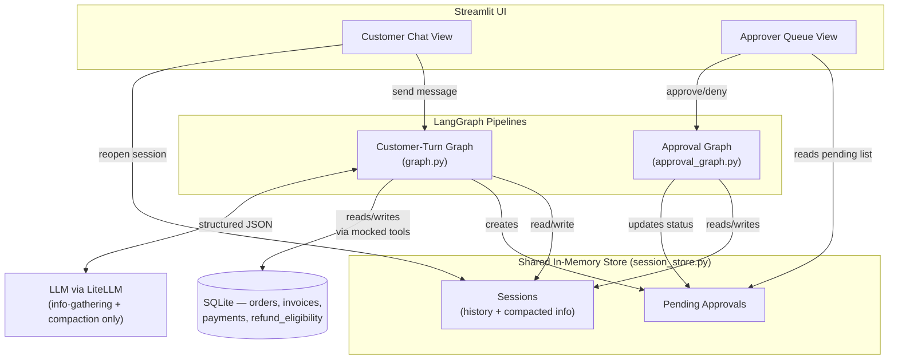

# Project Documentation: Multi-Agent Customer Support (with Async Human-in-the-Loop)

This document explains **what this project is, why it's built the way it
is, and which AI/software-engineering concepts it teaches**. It's written
for learners who understand basic Python and have some exposure to LLMs,
but are new to building multi-turn, multi-agent AI applications.

---

## 1. The Business Use Case

### The problem

Imagine you run an e-commerce company. Every day, hundreds of customers
message support with things like "where's my order," "I was charged
twice," or "I want a refund." Handling these with human agents alone is
slow and expensive. But fully automating support is risky — you don't
want a bot to have the power to refund ₹50,000 on its own judgment, or
to silently make a customer wait while it "thinks."

This project is a **proof-of-concept (POC)** — a simplified version built
to demonstrate an idea, not a finished product — for a support bot that:

1. **Talks to customers naturally**, across multiple messages, instead of
   demanding a rigid form up front.
2. **Automatically resolves low-risk requests** (billing questions, small
   account issues) using specialist "agents" backed by tools.
3. **Never lets the AI approve money leaving the business on its own.**
   Every refund request — regardless of size — is sent to a human
   reviewer. The customer isn't kept waiting for that decision; they're
   told "you'll hear back," and the conversation moves on.

### Why this matters (the engineering lesson)

The interesting part of this project isn't "a chatbot that answers
questions" — that's common. The interesting part is **how it hands off a
sensitive decision to a human without blocking anything or being
insecure about it**. That pattern — *let the AI gather information and
prepare a decision, but require a human to actually pull the trigger on
anything risky, asynchronously* — shows up constantly in real production
AI systems: fraud review, content moderation, medical triage, loan
approval, and more.

---

## 2. Core Concepts — What's Used Here, and Why

Each concept below lives in its own file so you can point at one file and
see exactly where an idea is implemented. That's a deliberate teaching
choice: production codebases often mix concerns together, but that makes
concepts hard to isolate when you're first learning them.

### 2.1 Session — "remembering who you're talking to, across time"

**File:** [`session/session_store.py`](session/session_store.py), [`pipeline/state.py`](pipeline/state.py)

A **session** is one customer's ongoing conversation, identified by a
`session_id`. Unlike a single API call, a session has to *survive*:

- across multiple chat turns in one sitting, **and**
- across the customer closing the tab and coming back hours later.

This project stores sessions in a plain Python dictionary, shared across
the whole app (not per-browser-tab), so both the customer's chat view and
the approver's queue are reading and writing the exact same data:

```python
# session/session_store.py
_sessions: Dict[str, Dict[str, Any]] = {}

def get_or_create_session(session_id: str) -> Dict[str, Any]:
    if session_id not in _sessions:
        _sessions[session_id] = new_session_state(session_id)
    return _sessions[session_id]
```

**Why not just use Streamlit's built-in `st.session_state`?** Because
`st.session_state` is scoped to one browser tab. If the customer view and
the approver view each had their own private copy of "the world," the
approver's decision would never reach the customer — which defeats the
entire point of this project. A shared store is what lets two completely
separate people (customer, approver), acting at completely separate
times, affect the same conversation.

> **Note for later:** a real product would use a database (Postgres,
> Redis, etc.) instead of a Python dictionary, so data survives a server
> restart. See [Section 5](#5-production-level-enhancements).

### 2.2 Conversational Memory — the raw transcript

**File:** `SessionState.conversation_history` in [`pipeline/state.py`](pipeline/state.py)

Every message — from the customer and the bot — is appended to a simple
list:

```python
{"role": "user", "content": "I want a refund", "timestamp": "..."}
```

This is what makes the bot feel like a *conversation* instead of a
one-shot Q&A tool: every LLM call that needs the full context (like
deciding "do we have enough info yet?") reads this list.

### 2.3 Context Compaction — the most important idea in this project

**File:** [`pipeline/compaction.py`](pipeline/compaction.py)

Here's the problem: a conversation can grow to 10, 20, 50 messages. If
every downstream step (routing, the specialist agent, the tools it calls)
had to re-read and re-interpret the *entire* raw transcript, you'd pay for
it in three ways:

- **Cost** — you're re-sending (and re-paying for) the whole transcript
  to the LLM, over and over, for every little decision.
- **Latency** — bigger prompts take longer to process.
- **Reliability** — asking an LLM to hunt for "the order ID" buried in a
  long back-and-forth is more error-prone than handing it a clean field.

The fix: **do the expensive "understand the whole conversation" work
exactly once**, and convert it into a small, structured JSON object.
Every step after that only needs to look at the JSON — never the
transcript again.

```python
# pipeline/state.py
class CompactedTicketInfo(BaseModel):
    issue_summary: str
    issue_category: IssueCategory        # billing_issue | refund_request | ...
    order_id: Optional[str]
    refund_amount: Optional[float]
    customer_sentiment: CustomerSentiment
    info_complete: bool
    missing_fields: List[str]
```

Think of it like a doctor's intake form: the nurse has a long chat with
the patient, but what the doctor actually reads is a short, structured
summary — not a transcript of the whole conversation.

### 2.4 Structured Output from an LLM

**File:** [`llm/client.py`](llm/client.py)

Both the info-gathering step and the compaction step need the LLM to
reply with **exactly a JSON object** — not a paragraph of prose — so the
rest of the code can parse it reliably. This project uses
[LiteLLM](https://docs.litellm.ai/) (a library that lets you call almost
any LLM provider — OpenAI, Anthropic, local models — through one
consistent function) with JSON mode turned on:

```python
# llm/client.py
def complete_json(system_prompt: str, user_content: str, temperature: float = 0.0) -> dict:
    response = litellm.completion(
        model=LLM_MODEL,
        messages=[
            {"role": "system", "content": system_prompt},
            {"role": "user", "content": user_content},
        ],
        temperature=temperature,
        response_format={"type": "json_object"},
    )
    return json.loads(response.choices[0].message.content)
```

**Why go through LiteLLM instead of calling OpenAI's SDK directly?**
Because `LLM_MODEL` is just a config string (`config.py`). If you want to
switch from GPT-4o-mini to Claude or a local model, you change one line
of config — no code elsewhere in the app knows or cares which provider is
answering.

### 2.5 Multi-Agent Routing — a state machine, not a chain

**File:** [`pipeline/graph.py`](pipeline/graph.py)

This project uses [LangGraph](https://langchain-ai.github.io/langgraph/)
to describe the conversation turn as an explicit **state graph**: a set of
named steps ("nodes") connected by rules about what happens next
("edges"). This is a different mental model from a simple chain of
function calls — it's closer to a flowchart that code actually executes.

```python
graph.add_conditional_edges(
    "route",
    _route_by_team,
    {
        "payments_team": "billing_agent",
        "refunds_team": "refunds_agent",
        "unassigned": "general_support",
    },
)
```

Two kinds of decisions happen in this graph, and it's worth noticing the
difference:

- **LLM decisions** (info-gathering, compaction) — things that require
  understanding natural language.
- **Plain code decisions** (routing) — once you know
  `issue_category == "refund_request"`, deciding to go to the Refunds
  Agent is a simple `if` statement. **Not everything needs an LLM call.**
  Using a cheap, fast, deterministic `if` where one is sufficient is
  itself a lesson: reach for the LLM only where you genuinely need
  language understanding.

The full path for one customer message looks like:

```
info_gathering → (enough info?) → compaction → route → billing_agent
                        │                                    or
                    (not enough)                        refunds_agent
                        │                                    or
                       END                             general_support
                                                              │
                                                             END
```

### 2.6 Tool Use — letting code, not the LLM, touch real data

**Files:** [`tools/mock_tools.py`](tools/mock_tools.py), [`agents/billing_agent.py`](agents/billing_agent.py), [`agents/refunds_agent.py`](agents/refunds_agent.py)

"Tool use" (sometimes called "function calling") is the pattern where an
LLM doesn't directly access a database or an API — instead, regular code
calls a well-defined function on the LLM's behalf, and only structured
results come back. This project keeps it simple: once the
`CompactedTicketInfo` says `issue_category = "billing_issue"` and gives an
`order_id`, no more LLM reasoning is needed — the Billing Agent just calls
plain Python functions:

```python
# agents/billing_agent.py
invoice = lookup_invoice(order_id)
payment = check_payment_status(order_id)
```

These functions query a real (if small) database — see the next section.

### 2.7 A Real Embedded Database, with Read-Only Access

**Files:** [`db/schema.sql`](db/schema.sql), [`db/connection.py`](db/connection.py), [`tools/mock_tools.py`](tools/mock_tools.py)

The tools don't fabricate data — they query
[SQLite](https://www.sqlite.org/), an **embedded database** (the whole
database is just one file on disk, no separate server process needed —
perfect for a POC).

The more interesting lesson here is **least privilege**: the tools should
only ever be able to *read* data, never write it. This project enforces
that at the connection level, not just by convention:

```python
# db/connection.py
def get_read_only_connection() -> sqlite3.Connection:
    conn = sqlite3.connect(f"file:{DB_PATH}?mode=ro", uri=True)
    conn.row_factory = sqlite3.Row
    return conn
```

Opening the connection with `mode=ro` means SQLite itself will reject any
`INSERT`/`UPDATE`/`DELETE` attempted through it — you'll get a real
`sqlite3.OperationalError`, not just a bug that happens to not occur yet.
Only one file in the whole project (`db/init_db.py`) is ever allowed to
open a writable connection, and it's only used to build the sample data,
never at runtime.

*(Honest caveat: SQLite has no user/role permission system like
Postgres does — there's no `GRANT SELECT`. A read-only **connection** is
the strongest guarantee an embedded database can offer, and that's
enough for a POC. See [Section 5](#5-production-level-enhancements) for
what a production system would add.)*

### 2.8 Asynchronous Human-in-the-Loop — the key idea of this project

**Files:** [`agents/refunds_agent.py`](agents/refunds_agent.py), [`pipeline/approval_graph.py`](pipeline/approval_graph.py)

"Human-in-the-loop" (HITL) means a human makes the final call on
something an AI system prepares. The *naive* way to build this is to
literally pause the program mid-execution and wait for a person to click
a button — like a function call that doesn't return until someone
approves it.

**That's the wrong design here, and it's worth understanding why:**

- The approver is a different person, on their own schedule. They might
  review the queue in 5 minutes or 5 hours.
- If the bot's execution is frozen waiting on that human, you either tie
  up server resources for hours, or you need complex pause/resume
  machinery — and the customer is left staring at a spinner the whole
  time.

Instead, this project treats "pending approval" as **just a piece of
data** — a `PendingApproval` record with `status = "pending"` — not a
frozen program:

```python
# agents/refunds_agent.py
approval = PendingApproval(
    approval_id=str(uuid.uuid4()),
    session_id=state["session_id"],
    order_id=order_id,
    refund_amount=amount,
    reason="All refund requests require manual review before processing.",
    status=ApprovalStatus.PENDING,
    created_at=session_store.resolved_at_now(),
)
session_store.add_pending_approval(approval.model_dump())
```

The customer's graph run **finishes immediately** after filing this
record — it replies "you're under review" and returns control, exactly
like any other turn.

Later, whenever the approver clicks Approve or Deny, a **second,
completely separate** LangGraph run kicks off — one that has never met
the customer's original graph execution. It only knows about the shared
session store:

```python
# pipeline/approval_graph.py
def resolve_approval(approval_id: str, decision: str) -> None:
    approval = session_store.get_pending_approval(approval_id)
    session = session_store.get_session(approval["session_id"])
    ...
    result = _compiled_approval_graph.invoke(initial_state)
    session["conversation_history"] = result["conversation_history"]
    session_store.save_session(approval["session_id"], session)
```

The next time the customer opens that same session, the resolution
message is just... already there in the history — like a notification
that arrived while they were away. Two independent timelines, connected
only through shared storage. **This is the core teaching point of the
whole project.**

### 2.9 Why *not* LangGraph's `interrupt()`?

LangGraph has a built-in pause/resume mechanism (`interrupt()`) designed
for exactly this kind of "wait for a human" scenario. This project
deliberately avoids it. Why? Because `interrupt()` still models the
approval as a **suspended execution** — the graph run is frozen,
waiting. That's precisely the blocking model we just explained is wrong
for this use case. Modeling "pending" as a plain state value (a database
row with `status="pending"`) instead of a suspended process is what makes
the two flows (customer / approver) genuinely independent, with no
special resume logic needed.

---

## 3. Data Flow — How a Message Moves Through the System

### 3.1 High-level architecture



### 3.2 Customer-turn flow (one message in, one reply out)

```
 User sends message
        │
        ▼
 Load session (history + compacted_info) from shared store
        │
        ▼
 Append user message to history
        │
        ▼
 Info-Gathering Node  (LLM call — "is there enough info?")
        │
        ├── Not enough → generate a clarifying question,
        │                append it, END this turn
        │
        ▼ (enough info)
 Context Compaction Node  (LLM call — history → CompactedTicketInfo)
        │
        ▼
 Routing Node  (plain code, no LLM — reads issue_category)
        │
        ├── billing_issue ──────► Billing Agent ──► reply ──► END
        │
        ├── refund_request ─────► Refunds Agent
        │                              │
        │                     check_refund_eligibility (DB)
        │                              │
        │                     ┌────────┴────────┐
        │                   not eligible      eligible
        │                     │                  │
        │              reply: ineligible   create PendingApproval
        │                     │            reply: "under review"
        │                     ▼                  │
        │                    END ◄───────────────┘
        │
        └── anything else ──────► General Support fallback ──► END
```

Every arrow above ends at **END** within a single graph run — nothing in
this diagram pauses.

### 3.3 Approver flow (fully separate execution)

```
 Approver opens Pending Approvals view
        │
        ▼
 Sees list of PendingApproval records (status = "pending")
        │
        ▼
 Selects one → reviews CompactedTicketInfo + order/amount
        │
        ▼
 Clicks Approve or Deny
        │
        ▼
 NEW, independent graph invocation (approval_graph.py):
   - looks up the session by session_id
   - approved → builds a confirmation message
   - denied   → builds a rejection message
   - appends that message to the session's conversation_history
   - updates the PendingApproval status
        │
        ▼
 Next time the customer reopens that session, the message
 is already in the history — delivered asynchronously.
```

---

## 4. Project Structure at a Glance

```
streamlit_app.py          entry point — routes to a view
views/
  customer_chat.py         customer-facing chat UI
  approver_queue.py        approver-facing queue UI
session/
  session_store.py         shared store: sessions + pending approvals
pipeline/
  state.py                  schemas: SessionState, CompactedTicketInfo, PendingApproval
  graph.py                   the customer-turn LangGraph
  approval_graph.py          the separate approval-resolution LangGraph
  info_gathering.py          LLM node: enough info? else ask a question
  compaction.py               LLM node: history → CompactedTicketInfo
agents/
  billing_agent.py            calls billing tools, no LLM call
  refunds_agent.py             calls refund tools, files approvals, no LLM call
tools/
  mock_tools.py                 DB-backed lookup functions
db/
  schema.sql, seed_data.sql, init_db.py, connection.py    embedded SQLite layer
llm/
  client.py                    the one place litellm.completion() is called
config.py                       model name, DB path, etc. — no hardcoded values
```

---

## 5. Production-Level Enhancements

This project is intentionally a POC — several things are simplified so
the core concepts stay visible. If you were to take this toward a real
product, here's what you'd add (in rough order of "do this first"):

| Area | What's simplified now | What production needs |
|---|---|---|
| **Storage** | Python dict in memory — lost on restart | A real database (Postgres) for sessions and approvals, with migrations |
| **DB permissions** | SQLite connection-level read-only | A proper RDBMS with role-based `GRANT SELECT` on real per-table/view permissions, connection pooling |
| **Auth** | Anyone can open any session ID or the approver view | Real customer authentication + role-based access control so only authorized staff see the Approver Queue |
| **Reliability** | No retries; one failed LLM call just crashes the turn | Retries with backoff, fallback models (LiteLLM Router), circuit breakers |
| **Safety** | No PII redaction, no prompt-injection defenses | Redact sensitive data before sending to the LLM; detect/guard against injected instructions in customer messages |
| **Notifications** | Customer must reopen the chat to see a resolution | Push a real notification (email, SMS, in-app push) the moment an approval is resolved |
| **Observability** | No logging beyond what Streamlit shows | Structured logging, tracing (e.g. LangSmith/OpenTelemetry), and metrics (how long approvals sit, model latency/cost) |
| **Scale** | Graph runs synchronously inside the Streamlit request | Move graph execution to a background worker/task queue (e.g. Celery, RQ) so the UI isn't blocked on LLM latency |
| **Refund execution** | No real money moves — it's just a message | Real payment gateway integration for the actual refund, with idempotency keys so a retried request can't double-refund |
| **Testing** | Manual demo script only | Unit tests per node, and an "eval set" of sample conversations to catch prompt regressions when you tweak the system prompts |
| **Secrets** | API key in a local `.env` file | A secrets manager (AWS Secrets Manager, Vault, etc.) instead of plaintext `.env` |
| **SLA handling** | Approvals can sit forever with no urgency signal | Escalation rules — e.g., auto-flag or auto-escalate approvals that sit un-reviewed past a deadline |

---

## 6. Quick Glossary

- **Session** — one customer's ongoing conversation, identified by an ID, that can be resumed later.
- **State graph** — a flowchart-like structure of steps ("nodes") and rules for what happens next ("edges"), executed by code (here, via LangGraph).
- **Context compaction** — turning a long conversation into a small, structured summary so downstream steps don't need the full transcript.
- **Structured output** — forcing an LLM to reply in a fixed format (here, JSON) so code can reliably parse it.
- **Tool use / function calling** — letting deterministic code (not the LLM) perform real actions (like a database lookup), using structured inputs the LLM helped produce.
- **Human-in-the-loop (HITL)** — a workflow where a human makes the final call on something an AI prepared.
- **Asynchronous HITL** — the human's decision happens on their own schedule, without freezing or blocking the original process while it waits.
- **Least privilege** — giving a piece of code only the access it truly needs (e.g., read-only database access for tools that should never write).
